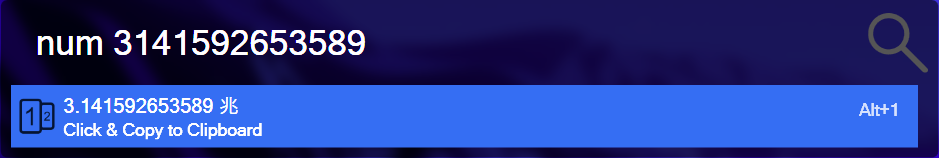

# How Big Your Number

Give a unit to the number.

 

## :wrench: Configuration

- `local`: language.
- `units`: the unit of number.

More configuration options, please see [config](.env).

## :pushpin: Requirements

- Python3.6(+)
- `pyperclip`
- `python-dotenv`

More requirements, please see [requirements.txt](requirements.txt).
